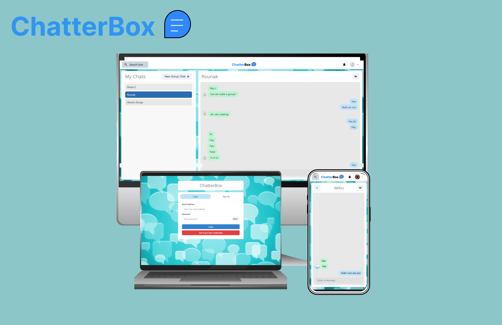
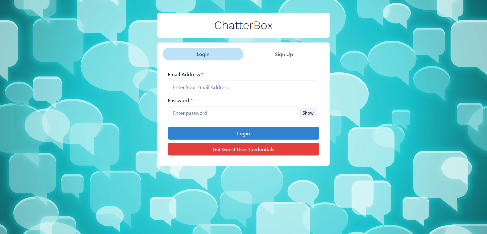
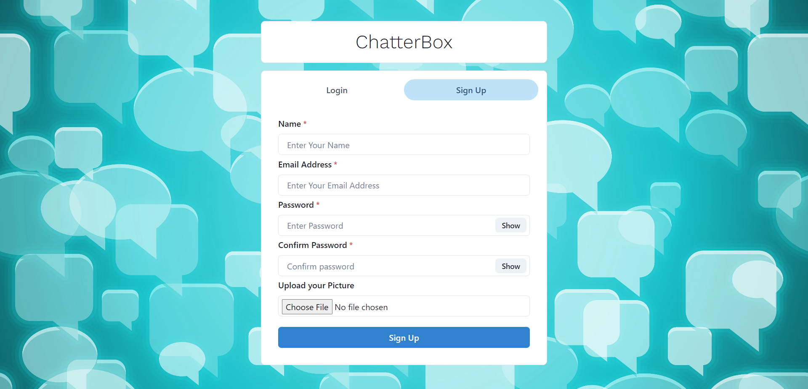
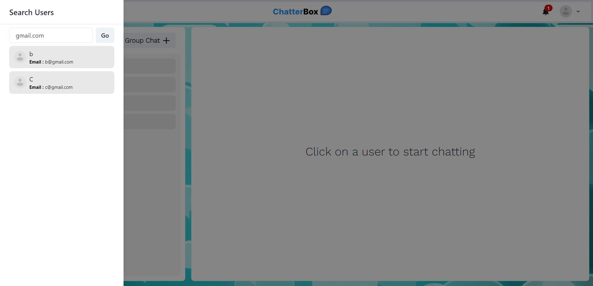
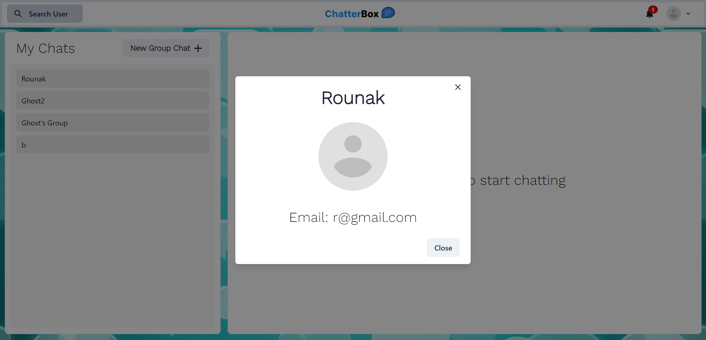
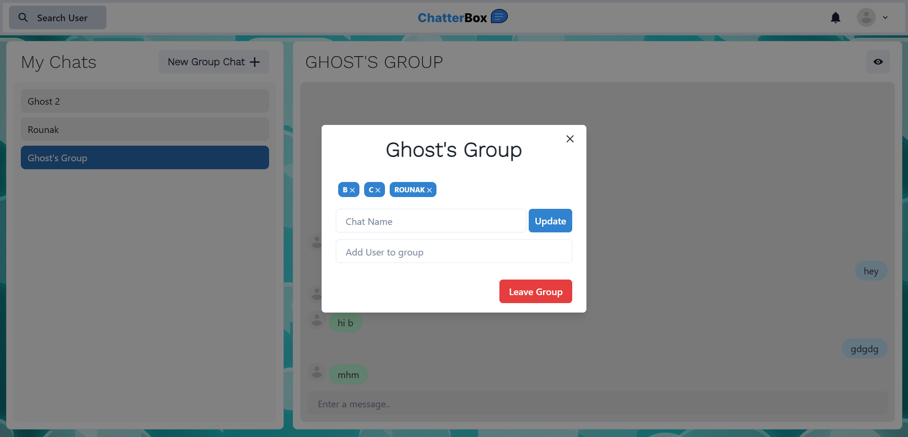
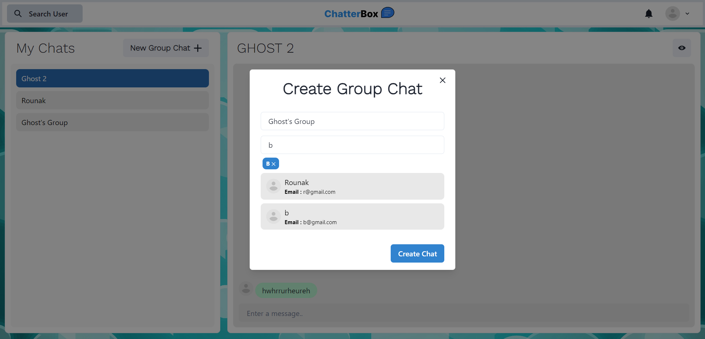
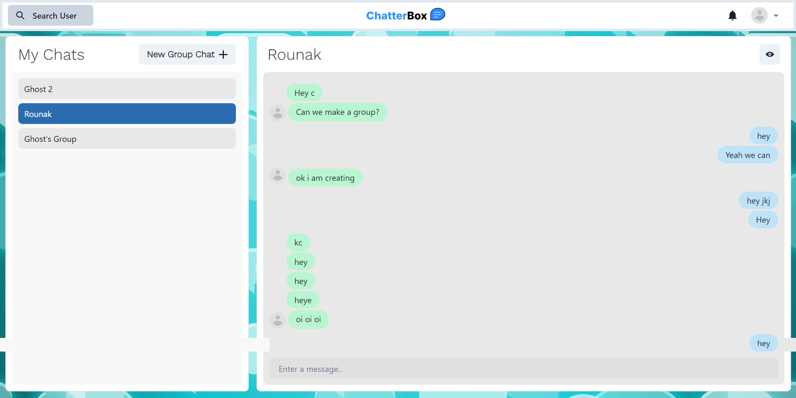
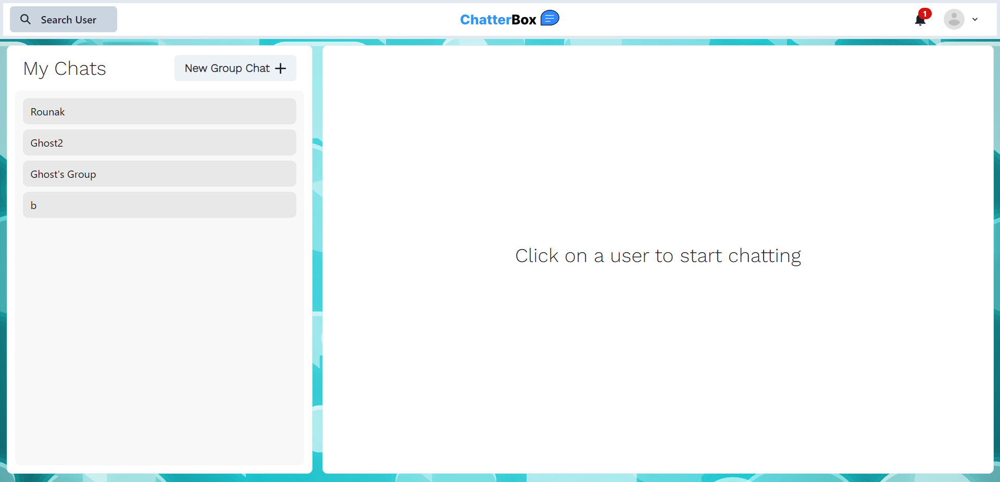

<h1 align="center">ChatterBox is a MERN based chatiing web application made with socket.io</h1>

<h3 align="center"><a href="https://chatterbox-o03k.onrender.com/"><strong>Want to see live preview »</strong></a></h3>

   
 

##  Features
- Login/Signup for Users
- Search Users via name and email
- One on One chat
- Creation of group
- Add people in group
- Remove people from group
- Rename Group
- PWA
   
## Glimpses of ChatterBox:

 <table>
  <tr>
     <td></td>
    <td></td>
  </tr>
  <tr>
  <td></td>
    <td></td>
  </tr>
  <tr>
  <td></td>
    <td></td>
  </tr>
  <tr>
    <td></td>
    <td></td>
  </tr>
  <tr>
    <td></td>
  </tr>
 </table>

 

## ALl Backend Routes:
  - HealthCheck : localhost:3000/api [GET]
  - User Register : localhost:3000/api/user/ [POST]
  - User Login : localhost:3000/api/user/login [POST]
  - Get All Users : localhost:3000/api/user/ [GET]
  - Access Chat : localhost:3000/api/chat/ [POST]
  - Fetch Chat : localhost:3000/api/chat/ [GET]
  - Create Group : localhost:3000/api/chat/group [POST]
  - Rename Group : localhost:3000/api/chat/rename [PUT]
  - Add To Group : localhost:3000/api/chat/groupadd [PUT]
  - Remove From Group : localhost:3000/api/chat/groupremove [PUT]
  - Send Message : localhost:3000/api/message/ [POST]
  - All Messages : localhost:3000/api/message/:chatId [GET]
