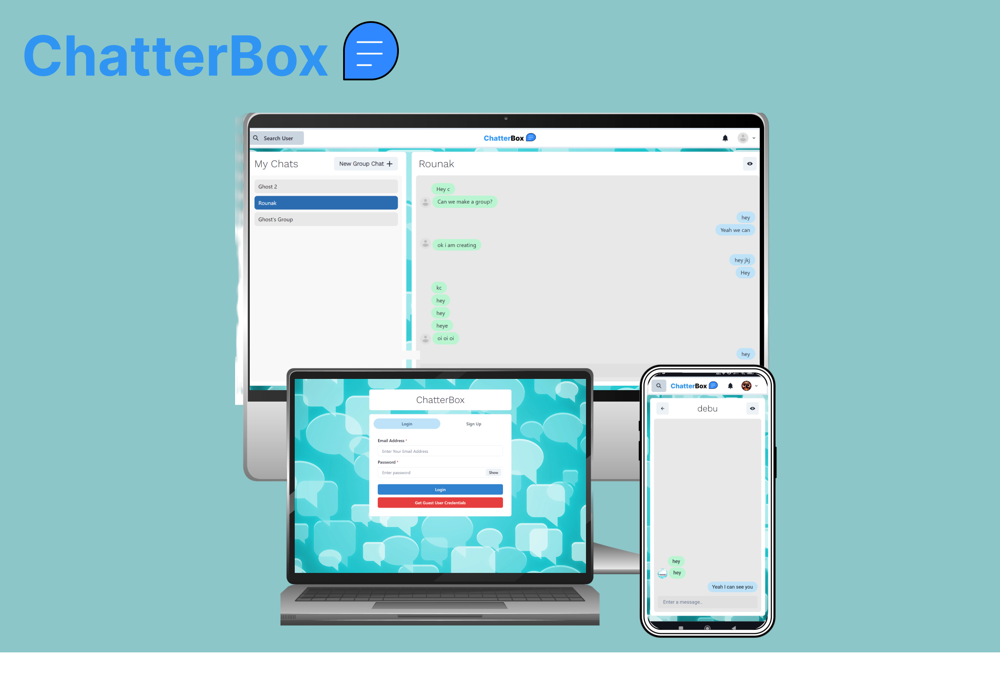

<h1 align="center">ChatterBox is a MERN based chatiing web application made with socket.io</h1>

<h3 align="center"><a href="https://chatterbox-o03k.onrender.com/"><strong>Want to see live preview »</strong></a></h3>

   
 

##  Features
- Login/Signup for Users
- Search Users via name and email
- One on One chat
- Creation of group
- Add people in group
- Remove people from group
- Rename Group
   
## Glimpses of ChatterBox:

 <table>
  <tr>
     <td></td>
    <td></td>
  </tr>
  <tr>
  <td></td>
    <td></td>
  </tr>
  <tr>
  <td></td>
    <td></td>
  </tr>
    <tr>
 <td></td>
    <td></td>
  </tr>
 </table>

 

## ALl Backend Routes:
  - 
